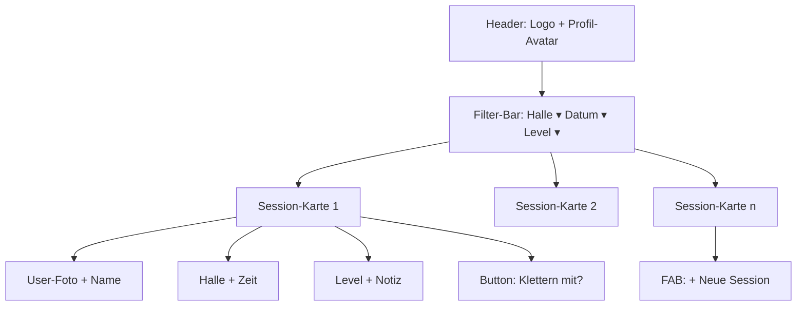

# BoulderSesh — Konzept & Plan

> Eine App, in der sich Boulder:innen verabreden können: eintragen, wann/wo/auf welchem Level man klettern will — andere User sehen es, matchen, chatten, klettern.

---

## 1. Vision & Zielgruppe

**Vision:** Die einfachste Art, spontan oder geplant einen Kletter-Buddy auf dem passenden Level zu finden — ohne Whatsapp-Gruppen, ohne Forum, ohne Glücksspiel.

**Zielgruppe:**
- Hobby-Boulder:innen, die regelmäßig oder sporadisch in Hallen klettern
- Leute, die in eine neue Stadt gezogen sind und Anschluss suchen
- Solo-Kletter:innen, die einen Buddy zum Spotten / Pushen / Quatschen suchen
- Fortgeschrittene, die jemanden auf ähnlichem Level für gezieltes Training suchen

**Kern-Wertversprechen (in einem Satz):** *"Sag der App, wann du wohin gehst — sie zeigt dir, mit wem du klettern könntest."*

---

## 2. Plattform-Empfehlung

**Empfehlung: Progressive Web App (PWA) für den MVP — Mobile-First Design.**

Begründung:
- Du hast mittleren Coding-Background → Web-Entwicklung hat die flachste Lernkurve.
- Eine PWA installiert sich auf dem Handy wie eine native App, bekommt ein Icon und kann (eingeschränkt) Push-Notifications. 90 % vom Mobile-Feeling, 30 % vom Aufwand.
- Kein App-Store-Approval (Apple-Review, Google-Play-Konto, $99/Jahr) → schneller iterieren, früher Feedback.
- Wenn die App läuft und User da sind: Mit demselben Codebase via Capacitor oder React Native eine native App nachschieben.

Trade-off: iOS-PWA-Push-Notifications sind seit iOS 16.4 möglich, aber nur wenn User die Web-App aktiv "zum Home-Bildschirm hinzufügt". Falls Push-Notifications für dich essenziell sind, ist eine native App via Expo/React Native der bessere Weg — siehe Stack-Option C unten.

---

## 3. Features — MVP und Backlog

### MVP (Phase 1) — das, was zur ersten Veröffentlichung muss

**3.1 Auth & Profil**
- Registrierung via E-Mail (Magic Link) oder Google/Apple Sign-In
- Profil: Name, Foto, Stamm-Halle(n), Skill-Level (Fb-Skala 4 – 8c+ oder grob "Anfänger / Mittel / Fortgeschritten / Profi"), kurzer Bio-Text, evtl. Boulder-Stil (Power, Slab, Technik, Dynamisch)

**3.2 Session anlegen**
- Halle auswählen (Liste vorgeben + "Halle hinzufügen")
- Datum + Uhrzeit (oder Zeitfenster, z. B. 17 – 20 Uhr)
- Level / Wunsch-Level der Buddies
- Optional: Notiz ("erste Sessions, suche jemand zum Erklären"), maximale Buddy-Anzahl
- Sichtbarkeit: öffentlich / nur Freunde

**3.3 Dashboard / Feed**
- Liste aller offenen Sessions in deiner Stadt (oder gewählten Hallen)
- Filter: Halle, Datum, Level
- Sortierung: nach Zeit, nach Match-Score
- Karten-Design mit User-Foto, Halle, Zeit, Level

**3.4 Match-Anfrage**
- Button "Klettern mit?" auf einer Session
- Ersteller bekommt Anfrage, kann annehmen oder ablehnen
- Bei Annahme: Match entsteht → Chat wird geöffnet

**3.5 Chat**
- 1:1 Chat (zwischen Match-Partnern)
- Echtzeit (Socket / Realtime)
- Push-Notification bei neuer Nachricht
- Sehr simpel: Text only, evtl. später Bilder/Voice

### Phase 2 — Backlog (nach MVP)

- **Gruppen-Sessions:** mehrere Buddies pro Session, Gruppen-Chat
- **Hallen-Datenbank:** echte Hallen mit Adresse, Öffnungszeiten, evtl. via OpenStreetMap
- **Bewertung / Vertrauen:** "Buddy bestätigen" nach der Session, evtl. Sterne
- **Wiederkehrende Sessions:** "jeden Donnerstag 18 Uhr in der DAV"
- **Crag/Outdoor:** auch für Outdoor-Spots, nicht nur Hallen
- **Kalender-Integration:** Sessions in iCal/Google Calendar exportieren
- **Push-Notifications:** "neue Session in deiner Halle heute Abend"

### Phase 3 — Wachstum

- Hallen-Partnerschaften (Boulderhallen integrieren als Partner, Marketing-Kanal)
- Trainingstagebuch (eingeloggte Sends, Wochenstatistik)
- Premium / Pro: erweiterte Filter, mehrere Stamm-Hallen, Sticker etc.
- Events (Wettkämpfe, Open Sessions)

---

## 4. Datenmodell (relational, vereinfacht)

```
users
  id (uuid, PK)
  email
  display_name
  avatar_url
  bio
  skill_level (enum: beginner | intermediate | advanced | pro
                oder Fb-Range, z. B. "5+ – 6c")
  preferred_styles (array: power, slab, technical, dynamic, ...)
  home_gym_id (FK → gyms.id, nullable)
  created_at

gyms
  id (uuid, PK)
  name
  city
  address
  lat, lng
  opening_hours (json, optional)

sessions
  id (uuid, PK)
  creator_id (FK → users.id)
  gym_id (FK → gyms.id)
  starts_at (timestamptz)
  ends_at (timestamptz, nullable)
  level (enum oder Fb-Range)
  note (text, optional)
  max_buddies (int, default 1)
  visibility (enum: public | friends)
  status (enum: open | matched | done | cancelled)
  created_at

session_participants     -- für Phase 2 (Gruppen-Sessions)
  session_id (FK)
  user_id (FK)
  joined_at

match_requests
  id (PK)
  session_id (FK)
  requester_id (FK → users.id)
  status (enum: pending | accepted | declined | cancelled)
  created_at

chats
  id (PK)
  session_id (FK, nullable — kann auch "freier Chat" sein)
  created_at

chat_members
  chat_id (FK)
  user_id (FK)
  joined_at
  last_read_at

messages
  id (PK)
  chat_id (FK)
  sender_id (FK → users.id)
  body (text)
  sent_at
  read_at (nullable)

friendships     -- Phase 2
  user_id (FK)
  friend_id (FK)
  status (enum: pending | accepted | blocked)
```

**Wichtige Indizes:** `sessions(gym_id, starts_at)` für Feed-Query; `messages(chat_id, sent_at)` für Chat-Verlauf.

---

## 5. User Flows

### Flow A: Onboarding (erstmaliger User)
1. Landing → "Account erstellen" mit Magic Link oder Google
2. Profil-Setup: Foto, Name, Stamm-Halle wählen (Suche oder hinzufügen), Level wählen
3. Mini-Tutorial (3 Karten: "Session eintragen", "Buddy finden", "Chatten")
4. Dashboard mit Sessions in der Stamm-Halle

### Flow B: Session eintragen
1. FAB-Button (+) → "Neue Session"
2. Halle auswählen (default: Stamm-Halle)
3. Tag + Uhrzeit (Quick-Buttons: "Heute Abend", "Morgen", oder Picker)
4. Level (default: eigenes Level, optional "egal")
5. Notiz (optional)
6. Veröffentlichen → erscheint im Feed

### Flow C: Buddy finden & matchen
1. Dashboard öffnen, Filter setzen
2. Karte tippen → Session-Detail mit User-Profil
3. "Klettern mit?" tippen → Anfrage geht raus, Status: "angefragt"
4. Ersteller bekommt Push-/In-App-Notification
5. Ersteller akzeptiert oder lehnt ab
6. Bei Annahme → Chat öffnet sich automatisch mit Begrüßungsnachricht

### Flow D: Chat & Verabreden
1. Chat-Liste zeigt aktive Matches
2. 1:1 Chat — Text, später Foto / Voice
3. "Treffpunkt fixieren" Button → erzeugt Bestätigungskarte im Chat
4. Nach Session: optional "Buddy bestätigen" (Vertrauenssystem für Phase 2)

---

## 6. Tech-Stack — drei Optionen im Vergleich

### Option A: Next.js + Supabase (Empfehlung für mittleres Level) ⭐

| | |
|---|---|
| **Frontend** | Next.js (React) + Tailwind CSS + shadcn/ui |
| **Backend** | Supabase (Postgres + Auth + Realtime + Storage) |
| **Hosting** | Vercel (Frontend) + Supabase Cloud (Backend) |
| **Mobile** | Als PWA installierbar; später Capacitor für native |
| **Echtzeit-Chat** | Supabase Realtime auf `messages`-Tabelle |
| **Push** | Web Push API; native via Capacitor |

**Pro:**
- Sehr schnell vom Konzept zum lauffähigen Prototyp (1 – 2 Wochenenden)
- Auth, Datenbank, Realtime, File-Storage in einer Plattform
- Row-Level-Security in Postgres → saubere Berechtigungen
- Großes Ökosystem, viele Tutorials genau für solche Apps

**Contra:**
- Vendor-Lock-in (aber Supabase ist Open Source und selbst-hostbar)
- Free-Tier hat Limits (für MVP aber locker ausreichend)

### Option B: Firebase + React Native (wenn dir nativ wichtig ist)

| | |
|---|---|
| **Frontend** | React Native (Expo) |
| **Backend** | Firebase (Firestore + Auth + Cloud Messaging) |
| **Hosting** | Expo EAS Build → App Stores |

**Pro:**
- Echte native App, beste UX auf iOS/Android
- Push-Notifications "out of the box" via FCM/APNs
- Gut, wenn du eh in den App-Store willst

**Contra:**
- Steilere Lernkurve, längerer Weg zum ersten lauffähigen Prototyp
- Firestore ist NoSQL — andere Denkweise als SQL, Joins schwieriger
- Submission-Aufwand (Apple Developer $99/Jahr)

### Option C: SvelteKit + Supabase (wenn du was Modernes lernen willst)

Wie Option A, aber Frontend mit SvelteKit statt Next.js. Weniger Boilerplate, schneller zu lernen, kleinere Community als React. Gute Wahl wenn du React noch nicht kennst und sowieso was Neues lernst.

### Meine Empfehlung

→ **Option A: Next.js + Supabase + Tailwind**, deployed auf Vercel.

Damit hast du in 1 – 2 Wochenenden den ersten klickbaren Flow, kannst Freunde testen lassen, und falls BoulderSesh abhebt, ist der Migrationspfad zu nativem Mobile (Capacitor / React Native + Supabase) klar.

---

## 7. Roadmap (realistisch nebenher)

| Phase | Inhalt | Zeitschätzung (nebenher) |
|---|---|---|
| **0. Setup** | Repo, Supabase-Projekt, Next.js-Skeleton, Tailwind, Auth-Magic-Link | 1 Wochenende |
| **1. Profile** | Profil anlegen/editieren, Avatar-Upload, Skill-Level | 1 Wochenende |
| **2. Sessions & Feed** | Session-CRUD, Halle-Auswahl, Dashboard mit Filter | 2 Wochenenden |
| **3. Match** | Anfrage stellen / annehmen / ablehnen, Notifications (in-app erst) | 1 Wochenende |
| **4. Chat** | 1:1 Chat mit Realtime, Liste der Chats | 2 Wochenenden |
| **5. Polish & Beta** | Empty-States, Loading, Errors, mobile Layout finalisieren | 1 – 2 Wochenenden |
| **6. Closed Beta** | Mit 5 – 20 Boulder-Freunden testen, Feedback, Bugfix | 2 – 4 Wochen real |
| **7. Soft-Launch** | In 1 – 2 Hallen kommunizieren, organisches Wachstum, PWA installierbar | offen |

Realistisch landest du bei **6 – 10 Wochenenden bis zum Beta-Release**, vorausgesetzt du arbeitest fokussiert.

---

## 8. Design / UX-Prinzipien

- **Mobile First.** Wer eine Boulder-Session sucht, hat das Handy in der Hand.
- **Maximal 2 Tap-Tiefen** zu allem Wichtigen: Session anlegen, Match finden, Chat lesen.
- **Klare Zustände**: jede Session ist offen / hat Anfragen / ist gematcht / ist vorbei.
- **Vertrauen aufbauen:** Profile mit echtem Foto + Halle wirkt sicherer als anonyme IDs.
- **Tonalität:** locker, klettercommunity-like, nicht corporate. ("Heute Abend in der Boulderwelt — wer kommt mit?")

### Hauptbildschirm — Mermaid-Skizze



---

## 9. Risiken & Offene Fragen

- **Henne-Ei-Problem:** Ohne User keine Sessions, ohne Sessions keine User. → Lösung: Mit einer einzelnen Halle + ~20 Freunden starten, Inhalte selbst seeden, dann radial wachsen.
- **Sicherheit / Catfishing:** Profile mit echtem Foto + optional Verifikation per Hallen-QR-Code. Report-Button von Tag 1 an.
- **Datenschutz (DSGVO):** Standortdaten nur grob (Halle, nicht GPS), Impressum, Datenschutzerklärung, Lösch-Funktion fürs Profil.
- **Monetarisierung später:** Kostenlos für User. Mögliche Modelle: Hallen-Partnerschaften, Premium-Features (mehrere Stamm-Hallen, Sticker), keine Werbung.

---

## 10. Nächste konkrete Schritte für dich

1. Plattform-Entscheidung bestätigen (PWA via Next.js + Supabase?).
2. Halle(n) aussuchen, mit denen du startest (deine Stamm-Halle = perfekter Beta-Spot).
3. 5 – 10 Boulder-Freunde fragen, ob sie als Beta-User dabei sind.
4. Repo aufsetzen + Supabase-Projekt anlegen → erste Auth-Seite zum Laufen bringen.
5. Iterieren: lieber jedes Wochenende ein winziges Stück deployen als 3 Monate stille Entwicklung.

---

*Dokument erstellt am 10. Mai 2026 — bereit zum Weiterspinnen.*
